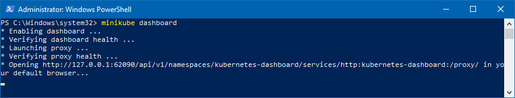
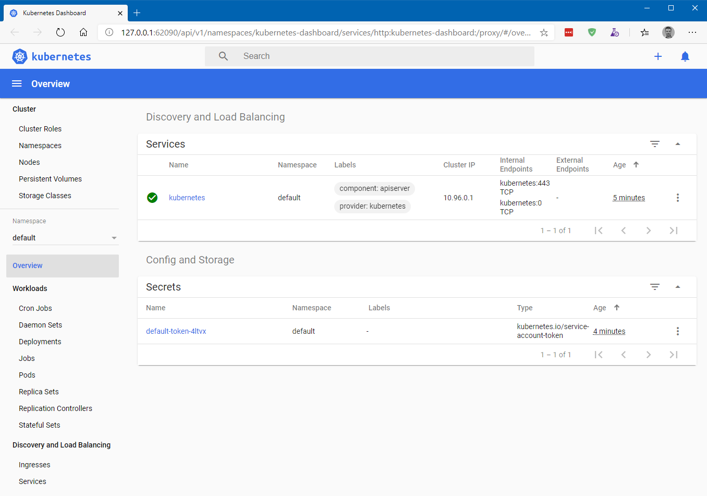
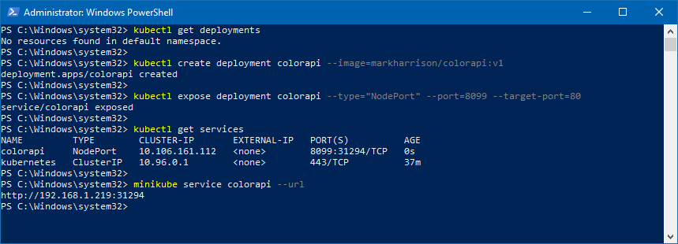
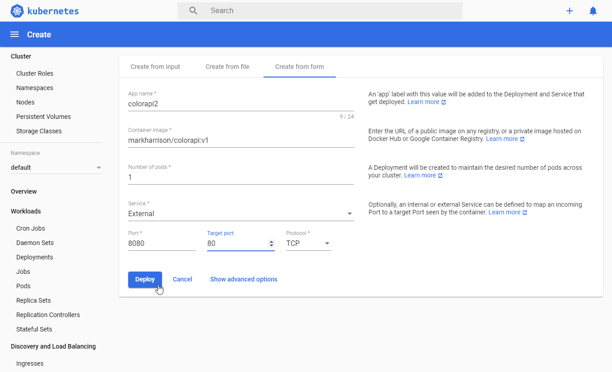
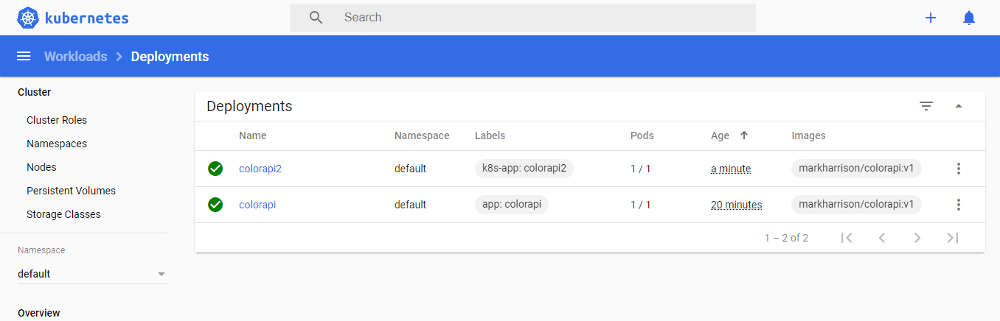
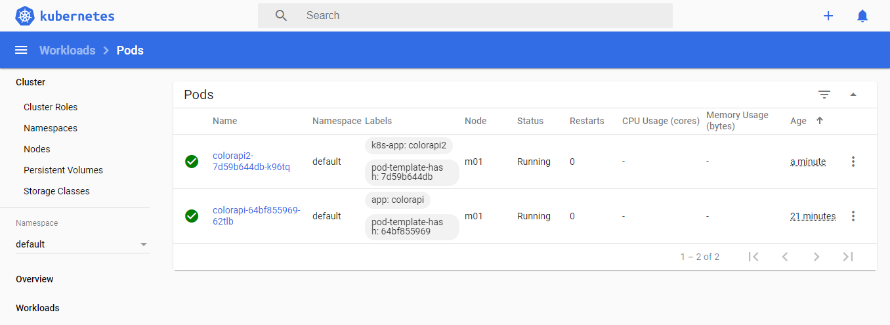
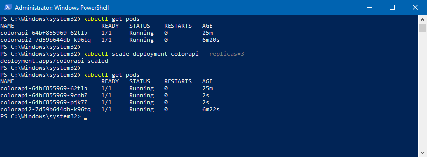
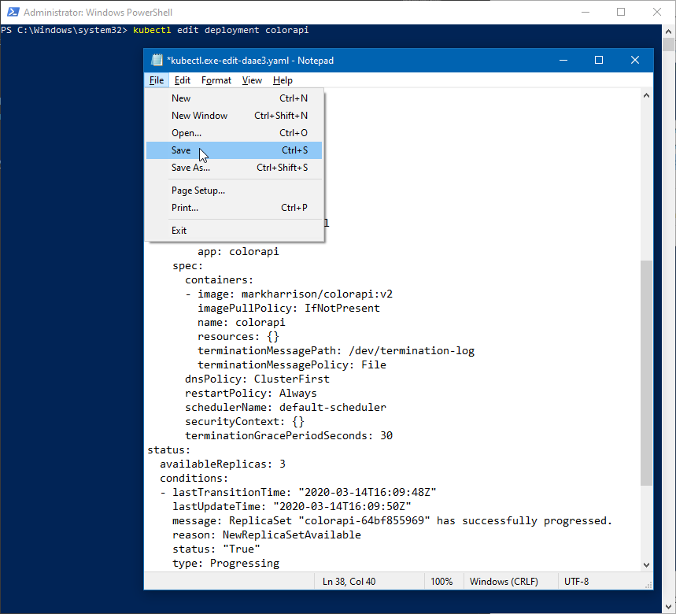
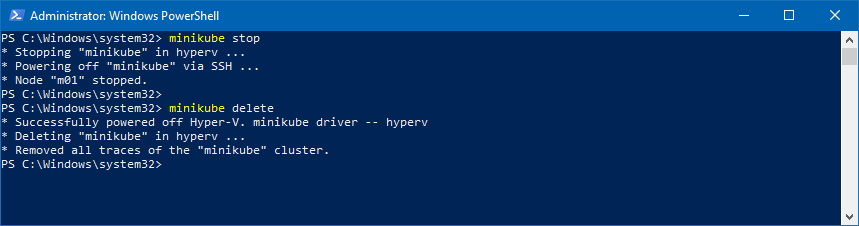

# Minikube - Hands-on Lab Script

Mark Harrison : 18 Nov 2017


## Overview

Minikube is a tool that makes it easy to run Kubernetes locally, for users looking to try it out  or to develop with it.

Minikube runs a single-node Kubernetes cluster inside a VM on a laptop.

<https://github.com/kubernetes/minikube>

Kubernetes command-line tool, kubectl, is used to deploy and manage applications on Kubernetes.

<https://kubernetes.io/docs/user-guide/kubectl-overview/>

## Installation

To install on Windows, use Chocolatey - which will install both minikube and kubectl :

<https://chocolatey.org/packages/Minikube>

- Invoke the following (elevated as administrator):

```text
choco install minikube
```


Alternatively to Chocolately - refer to the following for installation instructions:

<https://github.com/kubernetes/minikube>
<https://kubernetes.io/docs/tasks/kubectl/install/>

## Startup

Having installed Minikube - we need to start it.

- Assuming a Hyper-V virtualisation platform, invoke the following:
  - Amend switch name to whatever used in the Hyper-V networking
  - Amend memory depending on much is available

```text
minikube version

minikube start --vm-driver hyperv --hyperv-virtual-switch "vSwitch" --memory 4096

minikube status
```


- To see the state of the cluster, invoke the following:

```text
kubectl version

kubectl cluster-info
```


- To display the Kubernetes dashboard, invoke the following

```text
minikube dashboard
```





### Deployments

The next task is to install a service.  This will be a Web API application deployed from a container registry.

- Invoke the following:

```text
kubectl get deployments

kubectl run colorapi --image=markharrison/colorapi:v1 --port=80

kubectl expose deployment colorapi --type="NodePort" --port=8099 --target-port=80

kubectl get services

minikube service colorapi --url
```



- Browse to the assigned URL (append `/swagger`) e.g. <http://192.168.1.174:32284/swagger>

- This is V1 of the container - note that the RandomColor API returns a random shade of green.


Alternatively, can we can deploy the service from within the kubernetes dashboard:

- Select [Create] top right
- Specify App name - and docker image (ColorApi) to pull
- Check logs








## Scale

To scale up the service, we can increase the number of pods.

- Invoke the following:

```text
kubectl get pods

kubectl scale deployment colorapi --replicas=3

kubectl get pods
```




Minikube

## Resilience

Lets see what happens when a Pod dissapears.

- Invoke the following

```text
kubectl get pods

kubectl delete pod <pod-id>

kubectl get pods
```


- Notice that a new Pod is started, so that the number of pods remains at the required level

## Update

To update the service to a new version of the sofware, we can update the deployment definition.

- Invoke the following:

```text
kubectl edit deployment colorapi
```

- Edit the container image to point to V2 - save the file

 

- Browse to the service - same URL as before
- Note that V2 of the RandomColor API returns a random shade of blue (from above, it was previously shades of green).


## Stop / Delete

To wrap up - we need to stop and delete the cluster.

- Invoke the following :

```text
minikube stop

minikube delete
```



---
<http://github.markharrison.io>